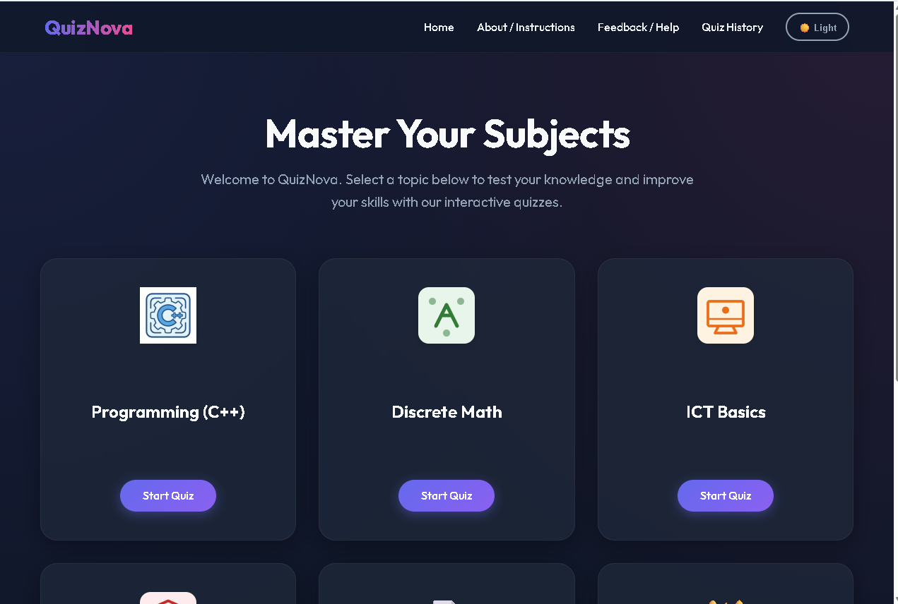
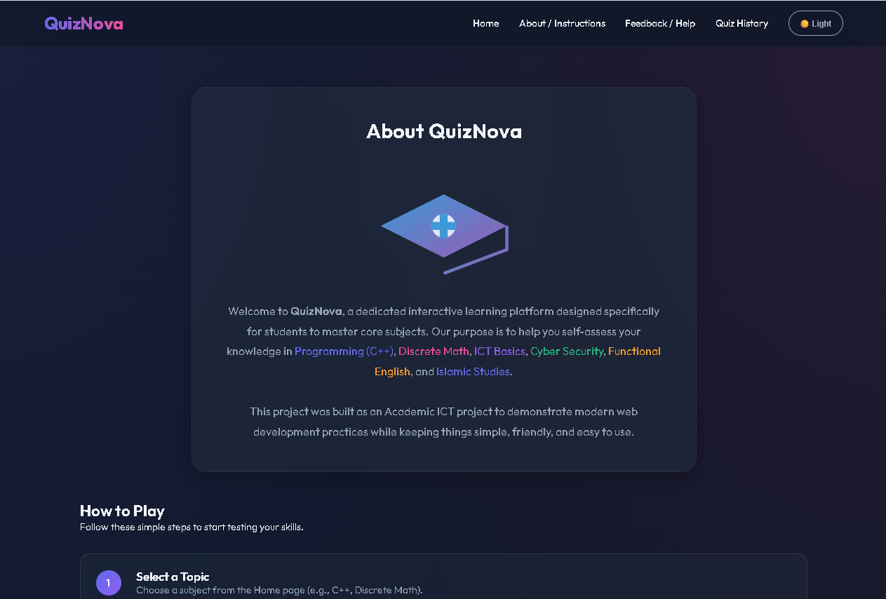
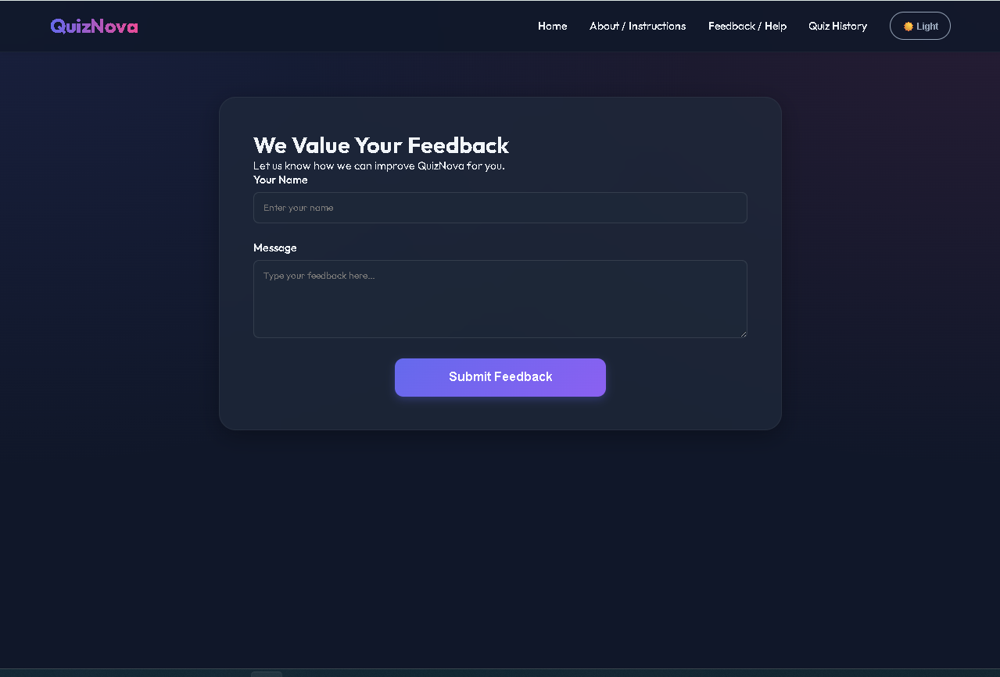
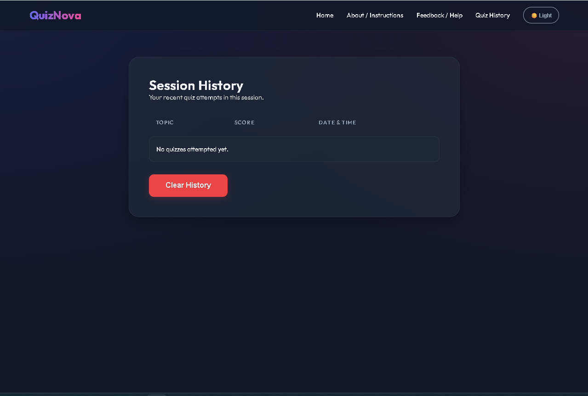

# ICT Quiz Website

[](https://hamidrafique2-boop.github.io/ICT-Project-Quiz-Assessment-Website/)

An interactive, modern, and professional frontend quiz platform built for students to master fundamental academic subjects. This project combines sleek UI design with robust JavaScript logic to provide a seamless learning experience.

## Introduction
The **ICT Quiz Website** is designed as a comprehensive learning platform to help students self-assess their knowledge in core academic areas. It provides an engaging way to test understanding through interactive quizzes, offering immediate feedback and performance tracking.

The platform features **six major subjects**:
- Programming Fundamentals (C++)
- Discrete Mathematics
- ICT Basics
- Cyber Security
- Functional English
- Islamic Studies

## Features
- 🚀 **Six Subject-Based Quizzes**: Tailored question pools for essential academic topics.
- 🔢 **Structured Assessments**: Exactly 10 questions per quiz to maintain consistency.
- ⏱️ **Real-time Countdown**: A 15-second timer per question to challenge your speed.
- 📉 **Automatic Scoring**: Instant calculation of results upon completion.
- 📜 **Quiz History Tracking**: View your previous attempts and improve over time.
- 🌓 **Theme Toggle**: Support for both Dark Mode and Light Mode for better accessibility.
- 📱 **Fully Responsive**: Optimized for desktops, tablets, and smartphones.
- 🌐 **Live Deployment**: Hosted and fully functional on GitHub Pages.

## Pages Overview
- **Home**: The landing page where users select their preferred subject icon to begin.
- **About / Instructions**: A detailed guide on how to play, scoring rules, and project background.
- **Quiz Mode**: The active interface where questions are displayed with a timer and progress bar.
- **Results**: A summary of your final score with personalized feedback and badges.
- **Quiz History**: A session-based log showing topic, score, and timestamps of past attempts.
- **Feedback / Help**: A dedicated communication channel for user queries and support.

## Technologies Used
- **HTML5**: Semantic structure for better SEO and accessibility.
- **CSS3**: Advanced styling including Flexbox, CSS Grid, and Glassmorphism effects.
- **JavaScript (Vanilla JS)**: Pure logic for timer, scoring, and local storage management.
- **GitHub Pages**: Automated CI/CD deployment for the live website.

## Folder Structure
```text
/
├── index.html          # Entry point (Home Page)
├── pages/              # Secondary application pages
│   ├── about.html      # About & Instructions
│   ├── feedback.html   # User Feedback
│   ├── history.html    # Session History
│   ├── quiz.html       # Active Quiz Interface
│   └── result.html     # Score Summary
├── images/             # Visual assets (SVGs, Icons, Backgrounds)
├── scripts/            # JS modular logic files
└── styles/             # Modular CSS stylesheets
```
- **root**: Contains the main landing page required for GitHub Pages hosting.
- **pages/**: Organizes all secondary views to maintain a clean root directory.
- **images/**: Stores all icons and SVGs used for branding and UI.
- **scripts/**: Houses the common utility functions and page-specific logic.
- **styles/**: Contains the design system and individual page styling rules.

## Team Members
- **Hamid Rafique**
- **Hashir Kamal Ahmed**
- **Wadia Sahar**

## Contribution Breakdown
- **Hamid Rafique**: UI/UX Design, CSS Design Systems, Responsive Layouts, and GitHub Repository Management.
- **Hashir Kamal Ahmed**: Core Quiz Engine Development, Timer Integration, and Dynamic Content Loading.
- **Wadia Sahar**: Session History Logic, Local Storage Management, Scoring Systems, and Testing.

## Deployment
The project is successfully deployed using **GitHub Pages**. Any changes pushed to the main repository are automatically reflected in the live environment.

🔗 **Live Link**: [View the Deployed Site](https://hamidrafique2-boop.github.io/ICT-Project-Quiz-Assessment-Website/)

## Screenshots
### Home Page


### About / Instructions


### Feedback / Help


### Quiz History


## Conclusion
The **ICT Quiz Website** serves as a robust example of modern web development applied to education. By focusing on user experience, performance, and clear feedback loops, it provides significant value to students looking to reinforce their academic foundations through interactive technology.

---
© 2025 ICT Project Team. All Rights Reserved.
